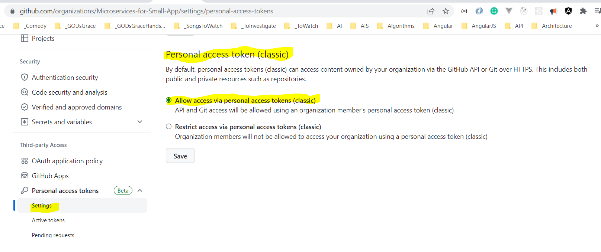

# Libraries-Common

A Common Library in .NET 7 which will be used by multiple microservices

## Create and publish package to Local Folder using dotnet CLI

```dotnetcli
dotnet new classlib -n CommonLibrary 

dotnet clean
dotnet build
dotnet pack -o C:\LordKrishna\Packages\

dotnet nuget add source C:\LordKrishna\Packages -n Local-Packages
```

## Add the GitHub package source

```powershell
$owner="Microservices-for-Small-App"
$username="vishipayyallore"
$gh_pat="ghp_Your_GitHib_Classic_PAT"

dotnet nuget remove source gHmicroservices

dotnet nuget add source --username $username --password $gh_pat --store-password-in-clear-text --name gHmicroservices "https://nuget.pkg.github.com/$owner/index.json"

dotnet nuget list source
```

## Create and publish package to GitHub using PowerShell

```powershell
$version="1.0.16"
$owner="Microservices-for-Small-App"
$username="vishipayyallore"
$repo="Libraries-Common"
$gh_pat="ghp_Your_GitHib_Classic_PAT"

dotnet clean
dotnet build -c Release
dotnet pack --configuration Release -p:PackageVersion=$version -o C:\LordKrishna\SSP\Packages -p:RepositoryUrl=https://github.com/$owner/$repo

dotnet nuget push C:\LordKrishna\SSP\Packages\CommonLibrary.$version.nupkg --source "gHmicroservices" --api-key $gh_pat
```




